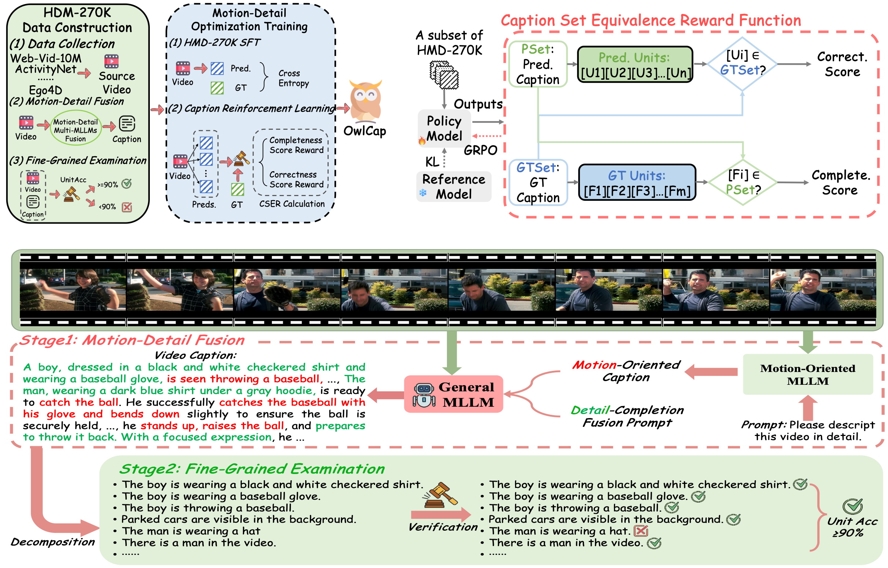

# OwlCap: Harmonizing Motion-Detail for Video Captioning via HMD-270K and Caption Set Equivalence Reward

<div align="center">

**Chunlin Zhong**<sup>1*</sup>, **Qiuxia Hou**<sup>2*</sup>, **Zhangjun Zhou**<sup>1*</sup>, **Yanhao Zhang**<sup>2+</sup>,  
**Shuang Hao**<sup>1,3</sup>, **Haonan Lu**<sup>2</sup>, **He Tang**<sup>1✉</sup>, **Xiang Bai**<sup>1✉</sup>

<sup>1</sup> School of Software Engineering,<br>
Huazhong University of Science and Technology,<br>
Wuhan, China  

<sup>2</sup> OPPO AI Center, OPPO Inc.,<br>
China  

<sup>3</sup> School of Life Science and Technology,<br>
Xi’an Jiaotong University, Xi’an, China  

</div>

<div align="center" style="margin: 20px 0;">

<a href="https://arxiv.org/abs/2508.18634"></a>
<a href="https://arxiv.org/pdf/2508.18634"></a>
<a href="https://huggingface.co/datasets/Chunlin13/HMD-270K"></a>
<a href="LICENSE"></a>

</div>

This repo is the official implementation of "[**OwlCap: Harmonizing Motion-Detail for Video Captioning via HMD-270K and Caption Set Equivalence Reward**](https://arxiv.org/abs/2508.18634)" (___AAAI 2026___).

We introduce **HMD-270K**, a large-scale high-quality video captioning dataset containing 270K videos with detailed and motion-aware captions.

**Contact:** clzhong@hust.edu.cn; hetang@hust.edu.cn; xbai@hust.edu.cn; {houqiuxia, zhangyanhao}@oppo.com

## 📸 Overview

<div align="center">
  
</div>

## 📅 Updates (Timeline)

- [x] **2025-08**: Paper released on arXiv
- [x] **2025-12**: HMD-270K Dataset public release → [Download on Hugging Face](https://huggingface.co/datasets/Chunlin13/HMD-270K)
- [x] **2025-12**: Training/test code & pre-trained model weights released

## 🔧 Installation & Environment Setup

This project is built upon **[VideoChat-R1](https://github.com/OpenGVLab/VideoChat)**.

Please follow the official installation guide of VideoChat-R1 to set up the environment first, then clone this repository:

```bash
git clone https://github.com/your_username/OwlCap.git
cd OwlCap
# Follow VideoChat-R1 setup instructions
pip install -r requirements.txt  # if additional requirements exist
