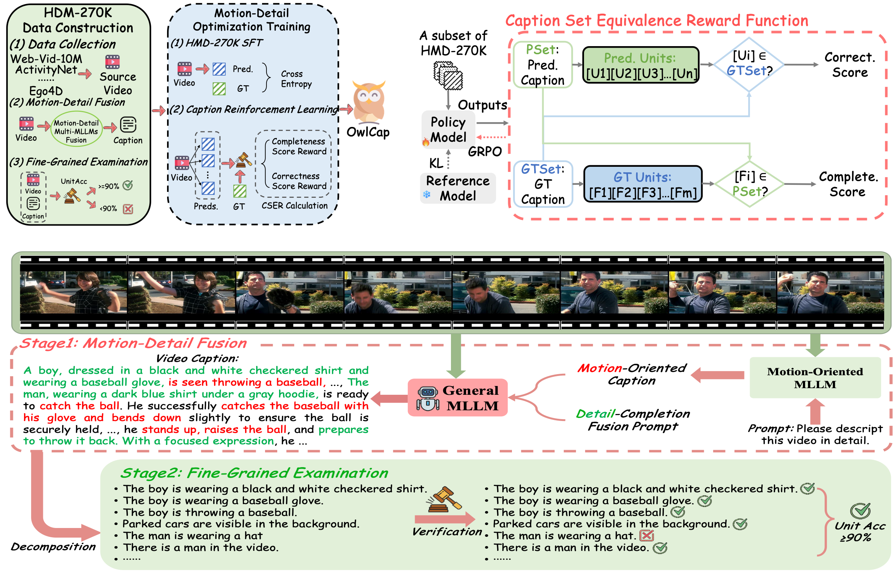

<h1 align="center">OwlCap: Harmonizing Motion-Detail for Video Captioning via HMD-270K and Caption Set Equivalence Reward</h1>
<div align="center">

**Chunlin Zhong**<sup>1*</sup>, **Qiuxia Hou**<sup>2*</sup>, **Zhangjun Zhou**<sup>1*</sup>, **Yanhao Zhang**<sup>2+</sup>,  
**Shuang Hao**<sup>1,3</sup>, **Haonan Lu**<sup>2</sup>, **He Tang**<sup>1✉</sup>, **Xiang Bai**<sup>1✉</sup>

<sup>1</sup> School of Software Engineering,<br>
Huazhong University of Science and Technology,
Wuhan, China  
<sup>2</sup> OPPO AI Center, OPPO Inc.,
China  
<sup>3</sup> School of Life Science and Technology,
Xi’an Jiaotong University, Xi’an, China  
</div>

<div align="center" style="margin: 20px 0;">

<a href="https://arxiv.org/abs/2508.18634"></a>
<a href="https://arxiv.org/pdf/2508.18634"></a>
<a href="https://huggingface.co/OwlCap"></a>
<a href="LICENSE"></a>

</div>

This repo is the official implementation of "[**OwlCap: Harmonizing Motion-Detail for Video Captioning via HMD-270K and Caption Set Equivalence Reward**](https://arxiv.org/abs/2508.18634)" (___AAAI 2026___).

We introduce **HMD-270K**, a large-scale high-quality video captioning dataset containing 270K videos with detailed and motion-aware captions.

**Contact:** clzhong@hust.edu.cn; hetang@hust.edu.cn

## 📸 Overview

<div align="center">
  
</div>

## 📅 Updates (Timeline)

- [x] **2025-08**: Paper released on arXiv
- [x] **2026-3**: HMD-270K Dataset public release → [Download on Hugging Face](https://huggingface.co/datasets/OwlCap/HMD-270K)
- [x] **2026-3**: Training/test code & pre-trained model weights released → [Download on Hugging Face](https://huggingface.co/OwlCap/OwlCap-7B)

## 🔧 Installation & Environment Setup

This project is built upon **[VideoChat-R1](https://github.com/OpenGVLab/VideoChat)**.

Please follow the official installation guide of VideoChat-R1 to set up the environment first, then clone this repository:

```bash
git clone https://github.com/your_username/OwlCap.git
cd OwlCap
# Follow VideoChat-R1 setup instructions
pip install -r requirements.txt  # if additional requirements exist
```
## Train

see training_scripts

## Eval
🔥 VDC Benchmark **[(Video Detail Captioning)](https://github.com/rese1f/aurora)**
Evaluate detailed video captioning performance using the lmms-eval framework.  
👉 Follow the protocol from: EvolvingLMMs-Lab/lmms-eval  

🔥 **[Dream-1K Benchmark]()**
Assess hallucination mitigation and fine-grained motion/detail perception on challenging videos.  
👉 Follow the evaluation protocol from: ByteDance/Tarsier

## 📝 Citation
If you use the OwlCap dataset, code, or results in your research, please cite our AAAI 2026 paper:<br>
@article{zhong2025owlcap,<br>
  title={OwlCap: Harmonizing Motion-Detail for Video Captioning via HMD-270K and Caption Set Equivalence Reward},<br>
  author={Zhong, Chunlin and Hou, Qiuxia and Zhou, Zhangjun and Hao, Shuang and Lu, Haonan and Zhang, Yanhao and Tang, He and Bai, Xiang},<br>
  journal={arXiv preprint arXiv:2508.18634},<br>
  year={2025}<br>
}<br>

For questions or issues, please open an issue or contact the corresponding author at: [clzhong@hust.edu.cn]
